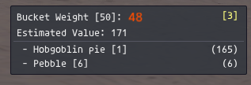
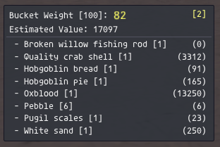

# Clammy
FFXI addon for AshitaXI v4 that displays basic clamming information. Bucket size & weight, countdown timer, and contents.

## Commands:
### Options
 `/clammy showvalue [true/false]` *Turn display of estimated value on/off*  
 `/clammy showitems [true/false]` *Turn display of individual items on/off*  
 `/clammy log true` *Turns on results logging - stores file in /addons/Clammy/logs*  
 `/clammy log false` *Turns off results logging (default)*  
 `/clammy tone [true/false]` *Turns on/off playing a tone when clamming point is ready to dig*  
### Debug
 `/clammy reset` *Manually clear bucket information*
 `/clammy weight` *Manually adjust bucket weight*
